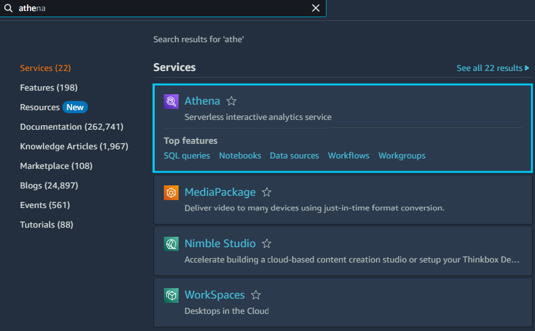
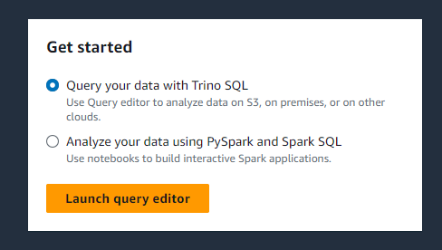
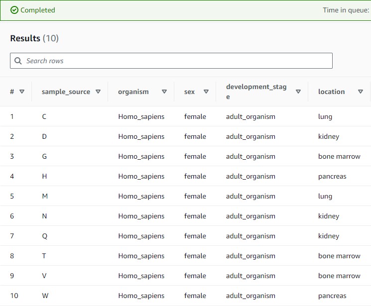
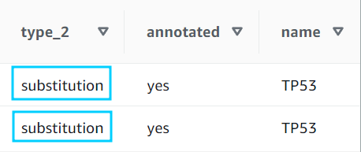
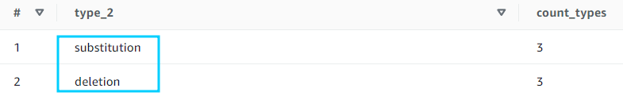
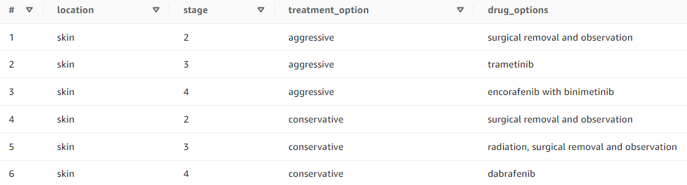
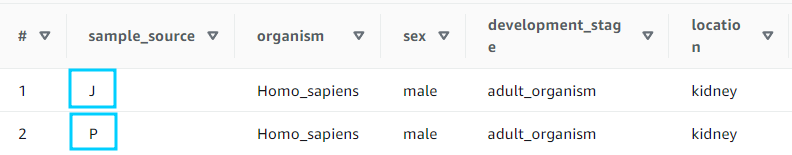
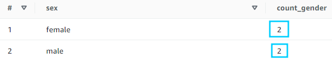
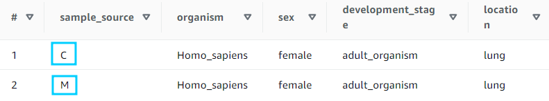

# AWS-Cancer-Hunters
In this project I'm going to use AWS (Amazon S3, Amazon Athena etc.) in order to help doctors treat cancer. Objectives for this project are provided by AWS Educate.

## Objectives

- Explore multiple cancer cell sample data sets using Athena SQL.
- Identify cancerous cell mutations from normal cell sequences.
- Investigate the errors in DNA sequences from retrieved genomic data.
- Discuss the potential targeted cancer treatment based on clinical DNA mutation data.


## Setting up an environment
Firstly, I opened AWS Console Home and searched for Athena


And created an instance


## Scenarios
I was presented with 4 scenarios from 4 different doctors

- SCENARIO 1: DR. WEI AND TP53 MUTATION:
"A researcher, Dr. Wei, is curious about the distribution of different cancers among women in his oncology practice. In particular, Dr. Wei is wondering if any of these cancers are TP53 mutations. Use the subset of your datasets to help Dr. Wei determine what type of cancer in females is caused by the TP53 mutation."

I started by querying for all female patients
```sql
SELECT * FROM samples 
WHERE sex = 'female'
```



Next, I was asked to answer following question: 
"What is the distribution of the location of cancer among female patients? For example, how many samples are from kidney, bone barrow, lung, or pancreas?"

```sql
SELECT *
FROM samples s
LEFT JOIN vcf v ON s.tumor = v.tumor
WHERE sex = 'female' and name = 'TP53'
limit 10;
```

Then, "what type of cancer is caused by the TP53 mutation?"
ANSWER: substitution



- SCENARIO 2: DR. SALAZAR AND BRAF MUTATIONS:
"Dr. Salazar has asked you to help discover if a BRAF mutation is responsible for any of the cancer occurrences in the dataset and to advise on treatments for three of her patients."

```sql
SELECT *
FROM samples s
LEFT JOIN vcf v ON s.tumor = v.tumor
WHERE name = 'BRAF';
```

```sql
SELECT type_2, count(*) as count_types
FROM (
    SELECT *
    FROM samples s
    LEFT JOIN vcf v ON s.tumor = v.tumor
    WHERE name = 'BRAF'
    )
GROUP BY type_2
```

"Which two types of cancer in the dataset are caused by the BRAF mutation?"
ANSWER: deletion and substitution



Dr. Salazar has asked you to advise on treatments for three patients with skin cancer and the BRAF mutations: Patient F, Patient S, and Patient U.

Patient F has advanced melanoma that requires aggressive treatment.
Patient S has stage 3 skin cancer (non-melanoma)
Patient U has stage 2 skin cancer (non-melanoma).

```sql
SELECT * FROM treatments
WHERE location = 'skin'
```



Dr. Salazar has asked you to advise on treatments for three patients with skin cancer and the BRAF mutations: Patient F, Patient S, and Patient U.
ANSWER:
Patient F - aggressive
Patient S - radiation, surgical removal and observation
Patient U - surgical removal and observation

- SCENARIO 3: DR. SANTOS’ KIDNEY RESEARCH:
Dr. Santos, a researcher who specializes in kidney cancer, has asked you for help with her dataset. She’s interested in discovering which of her patients have tumor mutations that are substitutions that are not of an annotated type. She’s also interested in your recommendations for treatments for these patients that she can share with her oncologist colleagues at the tumor board/grand rounds on Tuesday.

A substitution mutation occurs when one DNA base is substituted for another. Because no bases are added or deleted, the total number of bases in the gene remains the same. A substitution mutation can result in the following:
No change to the protein produced by the gene
A protein that has an incorrect amino acid in it due to the mutation
A truncated (shortened) protein because the substituted base results in a STOP codon, which stops protein translation

Help Dr. Santos determine which patients have kidney cancers and non-annotated substitution mutations.
```sql
SELECT *
FROM samples s
JOIN vcf v ON s.tumor = v.tumor
WHERE annotated = 'no' and location = 'kidney' and type_2 = 'substitution'
```

"Which patients (sample_source) have kidney cancer with a non-annotated substitution mutation?"
ANSWER: J and P



"What treatment options might you recommend for each of these patients?"
NOTE:
Patient J is in early stage 2 of the disease, and the oncologist would prefer to treat them with a conservative approach.
Patient P, however, needs more aggressive treatment because their cancer is stage 4.

ANSWER: 
J - radiation, surgical removal and observation
P - ipilimumab with nivolumab

- SCENARIO 4: DR. OWUSU AND LUNG CANCER PATIENTS
An oncologist, Dr. Owusu, wants to better understand the sex ratio (male to female) of lung cancer patients in her practice. She suspects that the patients that she’s treating aren’t representative of the national average for male-to-female ratio for lung cancer patients, but she needs data to verify this hypothesis. Dr. Owusu also needs to know which of her lung cancer patients have the annotated KRAS mutation because her clinic is participating in a research study for treatment options for patients with this type of mutation.

Statistics indicate that men are more likely to develop lung cancer than females. Does this dataset show that pattern? 

```sql
SELECT sex, COUNT(*) AS count_gender
FROM (
    SELECT * FROM samples 
    WHERE location = 'lung'
)
GROUP BY sex
```



"Which patients (sample_source) have the KRAS mutation in their lung cancer?"

```sql
SELECT *
FROM samples s
LEFT JOIN vcf v ON s.tumor = v.tumor
WHERE name = 'KRAS' and location = 'lung'
```





ANSWER: C and M

## Summary
With this query I finished my project. I found meaningful insides that brought real-life value into people's lives and simultaneously used AWS, as well as practiced SQL queries!

## Authors

- [@Szymon Poparda](https://www.linkedin.com/in/szymon-poparda-02b96a248/)


